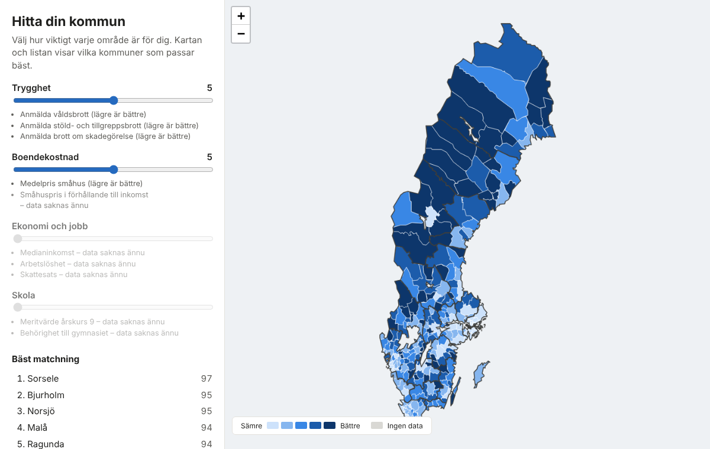

# Hitta din kommun

Rank Sweden's 290 municipalities (kommuner) by what matters to **you**. Move a
slider for each area of life (safety, housing cost, economy, schools) and the
map and list update with the best matches.



The app has no built-in idea of what a "good" kommun is. Every dimension counts
only as much as your slider says, and you can see the raw numbers behind each
score.

## Dimensions and indicators

Each slider weights a **dimension**. A dimension's score is the plain mean of
its indicators, so adding an indicator never gives a dimension more weight.
Dimensions live in `data/dimensions.json`, indicators in `data/indicators.json`.

| Dimension | Indicator | Source | Status |
|---|---|---|---|
| Trygghet | Reported violent crime, theft, vandalism per 1,000 inhabitants (average 2020–2022) | MSB, *Öppna jämförelser: trygghet och säkerhet 2023* (Brå) | loaded |
| Boendekostnad | Average small-house price 2025 | SCB, *Fastighetspriser och lagfarter* | loaded |
| Boendekostnad | House price / median income | computed when loading | after the first Kolada import |
| Ekonomi och jobb | Median income, unemployment, tax rate | Kolada | after the first Kolada import |
| Skola | Average merit value and gymnasium eligibility, year 9 | Kolada | after the first Kolada import |

Reported crime is not the same as all crime. It is also skewed by tourism,
commuting and shopping centres in small municipalities. The app says this on
the page.

## How it works

```
raw downloads (not committed)          data/ (committed, plain CSV/JSON)           SQLite (rebuilt on deploy)
  .xlsx / .csv / .shp  ──convert_*──▶  kommuner.csv                ──load_data──▶  Kommun, Dimension,
  Kolada API ─────────import_kolada─▶  dimensions.json                              Indicator, Value
                                       indicators.json
                                       values/<indicator>.csv
```

- `finder/sources.py`: parsers for each source format. They check headers and
  fail loudly instead of guessing.
- `finder/scoring.py`: each indicator is min-max scaled to 0–1, averaged within
  its dimension, then dimensions are combined with the user's weights. A kommun
  with missing data is scored on what it has and reports what's missing; it
  never gets a silent zero.
- `load_data` checks every value against the indicator's plausible `range` and
  computes `derived` indicators (e.g. price / income). It fails rather than load
  data that looks wrong, such as income in kr instead of tkr.
- `GET /api/rank?w_<dimension>=0..10`: JSON ranking used by the frontend.
- Frontend: plain JS with Leaflet (vendored in `finder/static/finder/vendor/`).
  The map uses a 5-step blue quantile scale. There are no background tiles:
  kommun shapes plus län outlines (merged from the kommuner) are the whole map,
  so the page makes no third-party requests.

## Run locally

```bash
python -m venv .venv && source .venv/bin/activate
pip install -r requirements-dev.txt
python manage.py migrate
python manage.py load_data
python manage.py runserver
```

Tests and lint:

```bash
python manage.py test
ruff check . && ruff format --check .
```

## Adding or updating data

### Kolada (automatic)

Indicators with a `kolada` entry in `data/indicators.json` are fetched from
[Kolada](https://www.kolada.se/)'s open API (v3):

```bash
python manage.py import_kolada            # all Kolada indicators
python manage.py import_kolada --only tax-rate
```

For each indicator it takes the newest year that covers at least 250 kommuner,
checks every value against `range` and writes `data/values/<slug>.csv`. If any
indicator fails, nothing is written.

An indicator can name its KPI (`"kpi": "N00900"`) or a title to search for
(`"search": "medianinkomst"`). A search must match exactly one kommun KPI;
otherwise the command lists the candidates so you can pin one. After a
successful import the KPI id is pinned in `indicators.json`.

**GitHub Actions** (`.github/workflows/update-data.yml`) runs the import monthly
and on demand (Actions → Update data → Run workflow). It checks the data loads
and the tests pass, then opens a pull request with the new CSVs and a table of
medians compared with last time. Merge it and Render redeploys. For the
workflow to open pull requests, enable *Settings → Actions → General → Allow
GitHub Actions to create and approve pull requests*.

To add an indicator: add an entry to `data/indicators.json` with a `kolada`
spec, a `dimension` and a plausible `range`, then run the import.

### Crime (Öppna jämförelser)

Download the yearly *Öppna jämförelser: trygghet och säkerhet* workbook, then:

```bash
python manage.py convert_crime raw/oppna-jamforelser-2023.xlsx
python manage.py load_data
```

Update `year`/`unit` in `data/indicators.json` if the period changes.

### House prices (SCB)

1. In [SCB Statistikdatabasen](https://www.statistikdatabasen.scb.se/), open
   *Boende, byggande och bebyggelse → Fastighetspriser och lagfarter*. Pick the
   table with the average purchase price (köpeskilling, medelvärde i tkr) for
   permanent small houses (permanenta småhus) by region.
2. Select **all kommuner**, **one year** and **one measure**, then export as CSV.
3. Convert it and load it:

   ```bash
   python manage.py convert_house_prices raw/scb-smahus.csv
   python manage.py load_data
   ```

4. Set `year` in `data/indicators.json` to the year you exported, then commit
   `data/values/house-price.csv`.

The converter accepts SCB's comma, semicolon or tab exports, either encoding,
and `..` for missing values. It rejects files with more than one value per
kommun.

### Map boundaries

`finder/static/finder/kommuner.geojson`, `lan.geojson` and `data/kommuner.csv`
were built from a SWEREF 99 TM kommun shapefile. Shared borders are simplified
once (a coverage simplification), so neighbouring kommuner still meet exactly.
Small overlaps in the source are assigned to one kommun and reported:

```bash
python manage.py build_geo raw/Kommun_Sweref99TM.shp --tolerance 400
```

## Deploy (Render, free tier)

`render.yaml` defines one free web service in Frankfurt. `build.sh` installs
the dependencies, collects static files and rebuilds the SQLite database from
`data/`. The app only reads the database, so it needs no hosted database.

1. Push this repo to GitHub.
2. In Render: **New → Blueprint** and pick the repo.

On the free tier the service sleeps after 15 minutes without traffic, so the
first request after that takes about a minute.

## Ideas

- More dimensions: commuting time, healthcare access, nature and climate.
- House prices from SCB's PxWebApi, so they update automatically too.
- Trends: Kolada has several years per KPI, enough to show change over time.
- Shareable links that keep the slider positions in the URL.
- A table view of all 290 kommuner.
